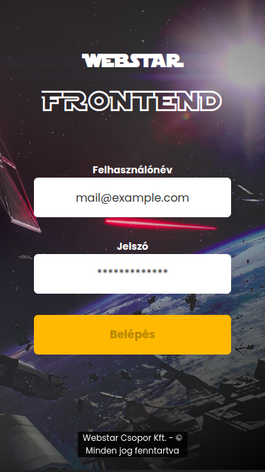
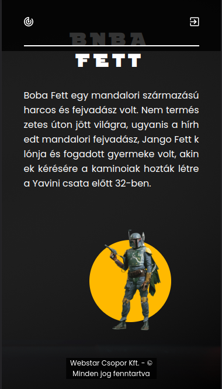
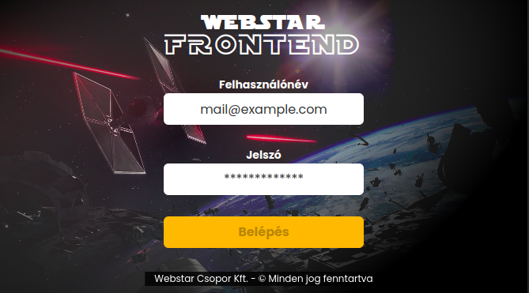
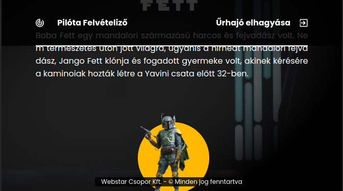
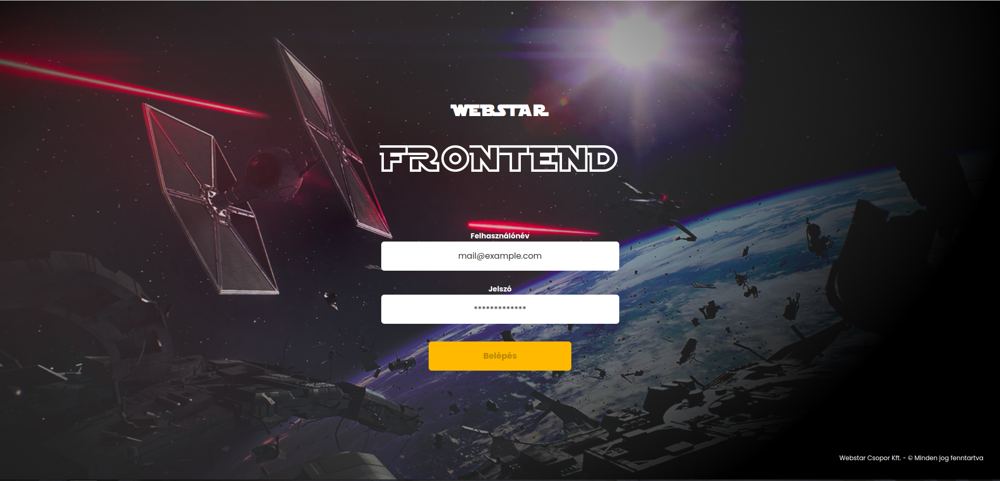
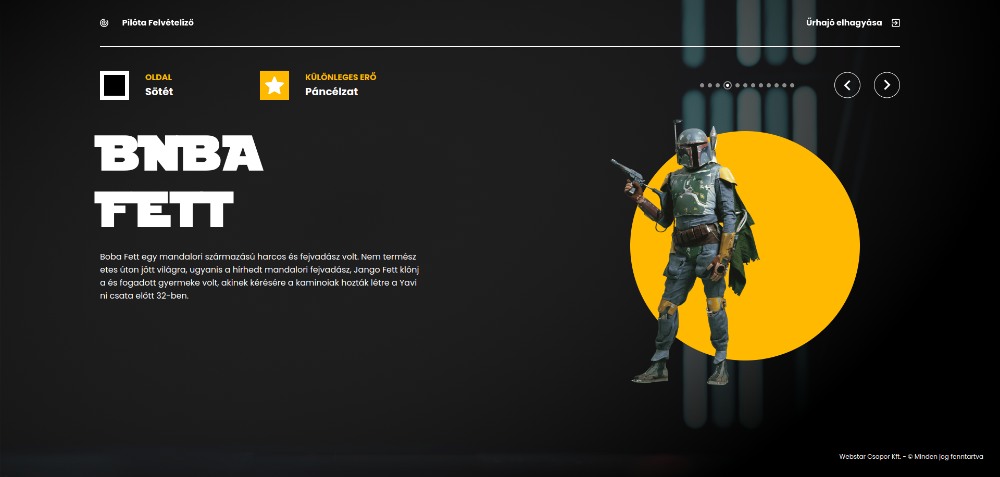

# WebStar

This Star Wars-themed project was created within one week.
This is my first project with these technologies, so I spent my first two days learning about Angular, TypeScript, and CSS preprocessors,
especially SASS/SCSS. All of this is still new to me, and I had some problems with my notebook during the project, so I had a few hard days,
but in the last two days, my computer worked just fine, and I managed to do this much.

## Design

### Mobile Vertical




### Mobile Horizontal




### Desktop




## Setup / Installation

1. If you do not have npm installed, then run the following command:

```bash
npm install -g npm
```

2. Run the follwoing to get the dependencies:

```bash
npm install
```

3. Check your node version using the following command:

```bash
nvm version
```

4. If you are using the newest or a really old version, then I recommend using the following:

```bash
nvm use 16.13.0
```

## Usage

To run the project in developer mode, use the following command in the directory of the project:

```bash
ng serve
```

Now, you can see the application on http://localhost:4200/

## Build

To run the project in productioon mode, you need to build first:

```bash
ng build --watch
```

In another terminal, you can use a webserver:

```bash
lite-server --baseDir="dist/WebStar"
```

## Features:

- Login page with JWT authentication, auth-guard, and logout
- Character-selection page with slider
- Responsive desing ( The character-selection could be more responsive, I only tested on few devices: )
  - Tested on:
    - iPhone SE
    - iPhone XR
    - iPhone 12 Pro
    - Pixel 5
    - Samsung Galaxy S8+
    - Samsung Galaxy S20 Ultra
   
## Technologies:

- Angular 14
- TypeScript
- SCSS
- HTML
